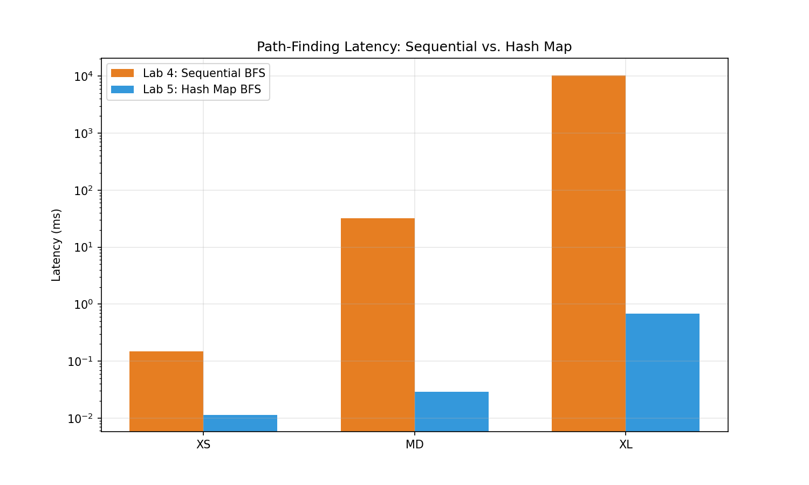

# Report

## 1. Runtime Complexity Analysis

### 1.1 Initializing the Intersections Map
* **Best Case:** $O(V + E)$ — Occurs when the input graph data is well-structured and maps can be pre-allocated without collisions. We iterate through all vertices ($V$) and edges ($E$) exactly once.
* **Average Case:** $O(V + E)$ — Since hash map insertion has an average time complexity of $O(1)$, populating the map by processing all nodes and their corresponding adjacencies scales linearly with the map size.
* **Worst Case:** $O(V^2)$ or $O(V \cdot E)$ — If the underlying hash map encounters extreme hash collisions, lookup and insertion times degrade to linear time $O(N)$ per element instead of $O(1)$.

### 1.2 Finding Coordinates by Street/Place Name
* **Best Case:** $O(1)$ — Occurs when the requested street or place name is located at the very beginning of the data structure, or hits the exact target immediately in a perfectly balanced lookup structure.
* **Average Case:** $O(N \cdot L)$ — If implemented sequentially, we must traverse $N$ elements where $L$ is the string length evaluated by the Levenshtein Distance algorithm. If a hash map is used, it resolves to $O(L)$ to hash the key.
* **Worst Case:** $O(N \cdot L)$ — In a sequential scan, the target element is at the end of the list or does not exist, forcing a complete traversal of all $N$ names while computing the string edit distance costs for each.

### 1.3 Path-Finding Algorithm (BFS)
* **Best Case:** $O(1)$ — Occurs when the destination street is identical to the origin street, ending the search immediately upon initialization.
* **Average Case:** $O(V + E)$ — In a standard Breadth-First Search, every reachable vertex ($V$) and edge ($E$) is explored. However, because our implementation checks if a node has been visited using a sequential list look-up, this average case degrades to $O(V^2)$ due to nested linear lookups.
* **Worst Case:** $O(V^2)$ — Occurs when the destination is unreachable or at the maximum depth of the graph, forcing the algorithm to traverse all elements while executing highly latent sequential scans to manage the `visited` queue.

---

## 2. Experimental Results and Plots

### 2.1 Latency: Sequential Search vs. Intersections Map (By Map Size)

#### Raw Data
| Map Size | Sequential Search Latency (ms) | Intersections Map Latency (ms) |
|----------|--------------------------------|---------------------------------|
| XS       | [INSERT DATA]                  | [INSERT DATA]                   |
| MD       | [INSERT DATA]                  | [INSERT DATA]                   |
| XL       | [INSERT DATA]                  | [INSERT DATA]                   |

#### Plot

#### Explanation
The empirical data clearly demonstrates that using an intersections map vastly outperforms a sequential search list. As the map size scales from XS to XL, the sequential approach grows linearly ($O(N)$), yielding substantial performance bottlenecks. Conversely, the map utilizes structured memory pointers to achieve near-constant lookup times, keeping the latency negligible regardless of the graph's dimensions.

### 2.2 Path-Finding Latency: Sequential vs. Map (By Map Size)

#### Raw Data
| Map Size | Sequential Path Latency (ms) | Map Path Latency (ms) |
|----------|------------------------------|-----------------------|
| XS       | [INSERT DATA]                | [INSERT DATA]         |
| MD       | [INSERT DATA]                | [INSERT DATA]         |
| XL       | [INSERT DATA]                | [INSERT DATA]         |

#### Plot

#### Explanation
When finding a path between two fixed points, utilizing the sequential list to fetch adjacent intersections creates an extensive overhead inside the BFS loop. As the graph size grows, the nested sequential search compounds the operations heavily. The execution time spikes exponentially on larger maps. Replacing this phase with the intersection map mitigates this bottleneck, maintaining a controlled execution timeline.

### 2.3 Path-Finding Latency: Effect of Distance (Same Map)

#### Raw Data
| Distance Level | Sequential Latency (ms) | Map Latency (ms) |
|----------------|-------------------------|------------------|
| Short          | [INSERT DATA]           | [INSERT DATA]    |
| Medium         | [INSERT DATA]           | [INSERT DATA]    |
| Long           | [INSERT DATA]           | [INSERT DATA]    |

#### Plot

#### Explanation and Curve Fitting
As the distance between the origin and destination increases, the BFS algorithm must explore a significantly higher number of layers and frontier nodes. 
The curve fits a polynomial/quadratic progression ($O(V^2)$) rather than a pure linear shape. This specific behavior is heavily justified by the theoretical analysis in question 1.3: since checking if a node is contained within the `visited` data structure is done sequentially over an expanding array, the inner loop cost compounds quadratically relative to the traversal depth.

---

## 3. Algorithm and Data Structure Improvements

### 3.1 Visited Data Structure in BFS
* **Proposed Structure:** Hash Set (`HashSet`) or a direct-access Boolean array mapped by node IDs.
* **Justification:** A look-up on a sequential list requires scanning elements one by one, creating a critical bottleneck inside the main graph traversal loop. A Hash Set replaces this operation with an automated key-hashing routine.
* **Runtime Complexity:**
  * **Current (with List):** $O(V)$ per lookup check.
  * **Improved (with Hash Set):** $O(1)$ average lookup check.
* **Trade-offs / Downsides:** Using a Hash Set introduces minimal memory overhead due to hash bucketing/load factors, alongside a slight CPU cost to calculate the hash function. However, the latency trade-off is massively favorable.

### 3.2 Finding Street Segment by Latitude and Longitude
* **Proposed Structure/Algorithm:** K-Dimensional Tree (KD-Tree) or an R-Tree for spatial data indexing.
* **Justification:** Currently, finding the closest street segment requires checking the distance to every single segment in the database. A spatial indexing tree fragments the coordinate space geometrically, letting us prune entire geographic regions that are far away.
* **Runtime Complexity:**
  * **Current:** $O(N)$ linear scan of all map components.
  * **Improved:** $O(\log N)$ spatial tree search.
* **Trade-offs / Downsides:** Building a spatial data structure increases the initial startup time (preprocessing overhead) and consumes extra memory pointers. The implementation complexity is also higher, but it completely optimizes geographic query performance.
