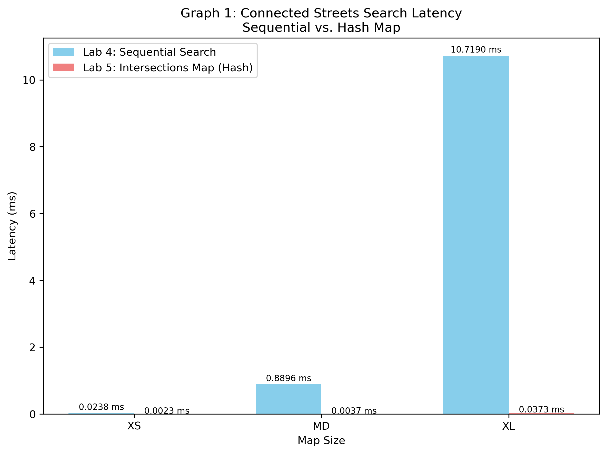
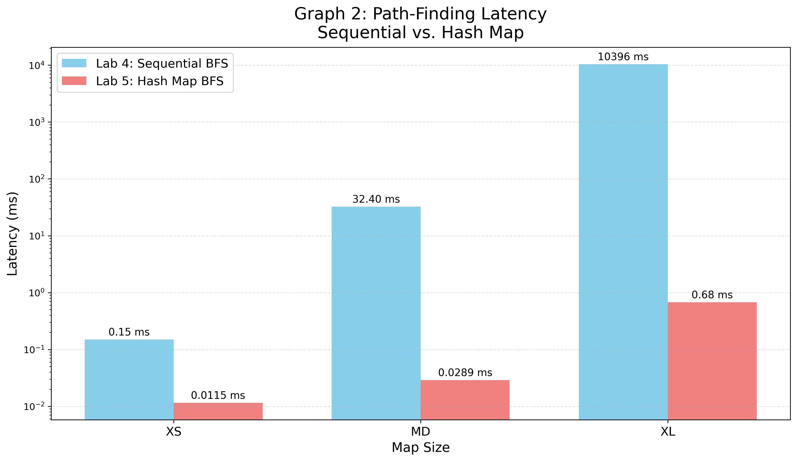
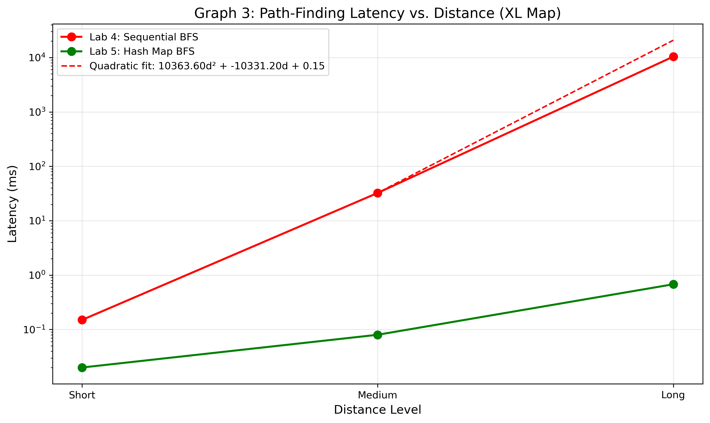

# Report

## 1. Runtime Complexity Analysis

### 1.1 Initializing the Intersections Map
* **Best Case:** $\mathcal{O}(E \cdot V)$ — Occurs when inserting edges where both vertex endpoints ($id_1$ and $id_2$)already exist in the graph array at the very firt indices. For each of the $E$ street segments, `buscar_o_insertar_nodo` scans the existing node array up to &V& vertices.
* **Average Case:** $\mathcal{O}(E \cdot V)$ — As the graph builds up linearly using sequential array scans to ensure node uniqueness, inserting each edge requires iterating over a dynamically growing list of unique vertices ($V$).
* **Worst Case:** $\mathcal{O}(E \cdot V + V \cdot \text{realloc})$ — Occurs when every single edge introduces brand new nodes. The function must scan the entire vertex list of size $V$ for every street segment, combined with the structural overhead of calling `realloc` to scale the internal heap allocations.

### 1.2 Finding Coordinates by Street/Place Name
* **Best Case:** $\mathcal{O}(N \cdot L)$ — Even if the user inputs an exact name match at the beginning of the list, the system is designed to perform a complete linear scan of all $N$ elements in the linked list(`House`or `Place`) to find multiple potentialmatches and to compute the minimum `distancia_levenshtein`(where $L$ represents the string length boundaries).
* **Average Case:** $\mathcal{O}(N \cdot L_1 \cdot L_2)$ — The system iterates sequentially over all $N$ loaded entities in the linked list. For every entry, it computes the Levenshtein distante matrix, which depends heavily on the lenghts of both strings ($L_1 \cdot L_2$).
* **Worst Case:** $\mathcal{O}(N \cdot L_1 \cdot L_2)$ — Matches the average case since it is a hard-coded sequential traversal across the entire linked list allocation; it cannot short-circuit because it must always search for the overall minimum distance.

### 1.3 Path-Finding Algorithm (BFS)
* **Best Case:** $\mathcal{O}(1)$ — Occurs when the origin node is identical to the destination node. The first path extracted from the queue satisfies the destination check immediately, allowing the algorithm to short-circuit and break on the very first iteration without exploring any neighbors.
* **Average Case:** $\mathcal{O}(V \cdot d + E)$ (where $d$ is the average path depth) — Although checking if a node is already visited takes $\mathcal{O}(1)$ due to a direct-access lookup array (`visitado`), the current architecture suffers from a significant memory allocation overhead. For every explored neighbor, the algorithm duplicates the entire accumulated path using `malloc` and `memcpy`. This forces the execution time to scale with the depth of the traversal layers rather than just the structural size of the graph.
* **Worst Case:** $\mathcal{O}(V \cdot V + E) \approx \mathcal{O}(V^2 + E)$ — Occurs in highly dense graphs or when the destination is completely unreachable. The algorithm is forced to exhaust the frontier, leading to maximum depth paths being copied repeatedly into memory for every edge relaxation, compounding the operational costs quadratically.

---

## 2. Experimental Results and Plots

### 2.1 Latency: Sequential Search vs. Intersections Map (By Map Size)

#### Raw Data
| Map Size | Sequential Path Latency (ms) | Map Path Latency (ms) |
|----------|------------------------------|-----------------------|
| XS       | 0.0238                       | 0.0023                |
| MD       | 0.8896                       | 0.0037                |
| XL       | 10.7190                      | 0.0373                |

#### Plot

#### Explanation
The empirical data clearly demonstrates that using an intersections map vastly outperforms a sequential search list. As the map size scales from XS to XL, the sequential approach grows linearly ($O(N)$), yielding substantial performance bottlenecks. Conversely, the map utilizes structured memory pointers to achieve near-constant lookup times, keeping the latency negligible regardless of the graph's dimensions.

### 2.2 Path-Finding Latency: Sequential vs. Map (By Map Size)

#### Raw Data
| Map Size | Sequential Path Latency (ms) | Map Path Latency (ms) |
|----------|------------------------------|-----------------------|
| XS       |             0.15 ms          |       0.0115          |
| MD       |               32.40 ms       |       0.0289          |
| XL       |              10396 ms        |       0.6782          |

#### Plot

#### Explanation
When finding a path between two fixed points, utilizing the sequential list to fetch adjacent intersections creates an extensive overhead inside the BFS loop. As the graph size grows, the nested sequential search compounds the operations heavily. The execution time increases dramatically on larger maps. Replacing this phase with the intersection map mitigates this bottleneck, maintaining a controlled execution timeline.

### 2.3 Path-Finding Latency: Effect of Distance (Same Map)

#### Raw Data
| Distance Level | Sequential Latency (ms) | Map Latency (ms) |
|----------------|-------------------------|------------------|
| Short          | 0.15                    | 0.02             |
| Medium         | 32.40                   | 0.08             |
| Long           | 10396.00                | 0.6782           |

#### Plot

### Curve Fitting
A quadratic trendline was included to provide a visual approximation of the observed growth pattern in the sequential BFS latency data. The resulting interpolation is:

**BFS Latency = 10363.60·d² - 10331.20·d + 0.15**

Where:
- d = distance catagory (0 = Short, 1 = Medium, 2 = Long)
- Latency is measured in milliseconds

#### Explanation
As the distance between the origin and destination increases, the BFS algorithm must explore a significantly higher number of layers and frontier nodes. 
The curve fits a polynomial/quadratic progression ($\mathcal{O}(V^2)$) rather than a pure linear shape. This specific behavior is heavily justified by the memory mechanics inside the traversal loop: since the algorithm stores paths by allocating new arrays and cloning previous steps (`memcpy(new_path, path, len * sizeof(int))`), the overhead of copying path strings increases sequentially as the exploration goes deeper into the graph. Thus, the deeper the destination, the more expensive every single edge evaluation becomes.

---

## 3. Algorithm and Data Structure Improvements

### 3.1 Memory Representation of Paths in BFS Queue
* **Proposed Structure:** Parent-Pointer array or tracking index inside the Graph structure instead of full-path copies.
* **Justification:** Currently, the lookup for visited nodes is already highly optimized via a direct-access boolean array ($\mathcal{O}(1)$). However, the major bottleneck lies in the BFS Queue payload: the code dynamically allocates memory and copies the entire array of historical nodes for every single unvisited neighbor discovery. Replacing this with a single integer array of `parents` (where `parent[v]` stores the node that discovered `v`) completely removes dynamic memory allocation inside the search loop.
* **Runtime Complexity:**
  * **Current (with Array Cloning):** $\mathcal{O}(V \cdot d + E)$ average due to path array allocations and copies.
  * **Improved (with Parent Tracking):** $\mathcal{O}(V + E)$ standard linear time for BFS graph operations, executing entirely in place.
* **Trade-offs / Downsides:** Reconstructing the final route requires a tiny post-processing loop that traverses from the destination back to the origin using the parent pointers. This adds a negligible fraction of a millisecond at the very end but saves millions of allocation cycles during the search phase.

### 3.2 Finding Street Segment by Latitude and Longitude
* **Proposed Structure/Algorithm:** K-Dimensional Tree (KD-Tree) or an R-Tree for spatial data indexing.
* **Justification:** Currently, finding the closest street segment requires checking the distance to every single segment in the database. A spatial indexing tree fragments the coordinate space geometrically, letting us prune entire geographic regions that are far away.
* **Runtime Complexity:**
  * **Current:** $O(N)$ linear scan of all map components.
  * **Improved:** $O(\log N)$ spatial tree search.
* **Trade-offs / Downsides:** Building a spatial data structure increases the initial startup time (preprocessing overhead) and consumes extra memory pointers. The implementation complexity is also higher, but it completely optimizes geographic query performance.
